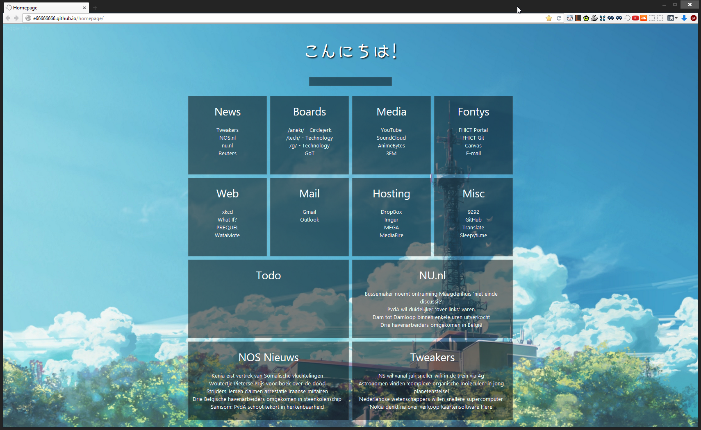

Homepage
=================

[Preview - search](screenshots/preview4search.png)
[Preview - mobile](screenshots/phone_preview3.png)
[Preview - mobile Chrome tabs](screenshots/phone_preview3.png)

A homepage with a bunch of links. Usable on phones, tablets and regular screen sizes. Made with html, css and javascript. (jquery, FeedEk, simpleWeather).

Features:
* Scaling for desktop and mobile browsers
* Location-based weather widget
* News feeds
* Conditional RSS articles
* Time-dependent random backgrounds
* Time-dependent Chrome tab color
* Blurrable background
* Todo-notes (saved with JavaScript cookies)
* In-Page Google Search results (taken from somebodies "homepagedark" example)

Live at [http://e66666666.github.io/homepage/](http://e66666666.github.io/homepage/)